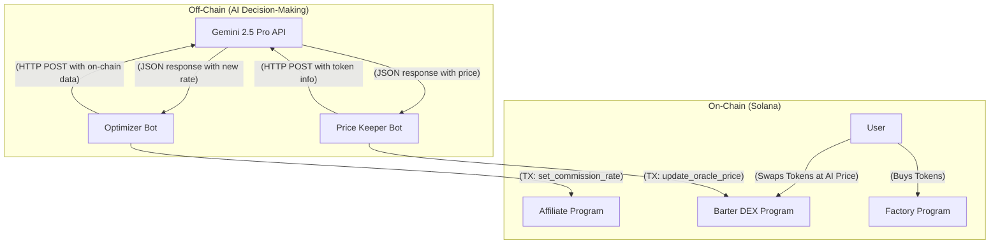

# Solana Launchpad Ecosystem (Rust) - AI Edition

This repository contains a multi-program Solana ecosystem in Rust, architected for **AI-driven tokenomics**. For a complete, machine-readable architecture, see `manifest.json`.

## System Overview

This project demonstrates a hybrid blockchain architecture. Deterministic on-chain programs handle asset management, while off-chain bots use the **Gemini 2.5 Pro API** to make intelligent economic decisions.

-   **ICO Factory:** A standard bonding curve launchpad.
-   **Affiliate System:** An on-chain program whose commission rates are dynamically set by an AI bot.
-   **Barter DEX:** An **oracle-based DEX** that uses AI-generated prices for swaps, instead of a traditional AMM formula.

## Repository Structure and Component Documentation

-   **`manifest.json`**: **Primary source of truth for the system architecture.**
-   **`programs/factory-program`**: The core ICO launchpad. ([See README](./programs/factory-program/README.md))
-   **`programs/affiliate-program`**: Manages affiliate data, controlled by AI. ([See README](./programs/affiliate-program/README.md))
-   **`programs/barter-dex-program`**: The AI-powered oracle DEX. ([See README](./programs/barter-dex-program/README.md))
-   **`bots/optimizer-bot`**: **(Gemini Integrated)** Off-chain bot to set affiliate commissions.
-   **`bots/price-keeper-bot`**: **(Gemini Integrated)** Off-chain bot that acts as a price oracle for the DEX.
-   **`crates/genesis-common`**: Shared library of constants.
-   **`tests/integration.rs`**: End-to-end tests.

## AI-Hybrid Interaction Diagram

## Setup and Execution

1.  **Prerequisites**: Install Rust, Solana CLI, Anchor Framework (v0.28.0).
2.  **API Key**: Create a file at `~/.api-gemini` and place your Gemini API key inside it.
3.  **Build**: `anchor build`
4.  **Test**: `cargo test-bpf -- --nocapture`