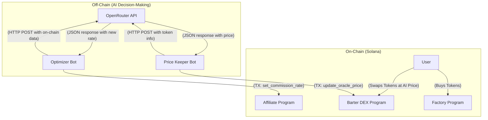

# Solana Launchpad Ecosystem - AI Edition

This repository originally contained a multi-program Solana ecosystem in Rust, architected for **AI-driven tokenomics**. The on-chain Anchor programs (factory, affiliate, barter DEX) were prototype-only and never deployed; since Solana's runtime only executes Rust or C, they cannot become Python, so they have been replaced with markdown design-reference docs under [`.claude/skills/`](./.claude/skills/) and their Rust source removed. The off-chain bots have been ported to Python. For the original system architecture, see `manifest.json`.

## System Overview

This project demonstrates a hybrid blockchain architecture: deterministic on-chain programs would handle asset management, while off-chain bots use the **OpenRouter API** to make intelligent economic decisions.

-   **ICO Factory:** A standard bonding curve launchpad. See [`.claude/skills/factory-launchpad/SKILL.md`](./.claude/skills/factory-launchpad/SKILL.md).
-   **Affiliate System:** A design for an on-chain program whose commission rates are dynamically set by an AI bot. See [`.claude/skills/affiliate-commissions/SKILL.md`](./.claude/skills/affiliate-commissions/SKILL.md).
-   **Barter DEX:** An **oracle-based DEX** design that uses AI-generated prices for swaps, instead of a traditional AMM formula. See [`.claude/skills/barter-dex-oracle/SKILL.md`](./.claude/skills/barter-dex-oracle/SKILL.md).

## Repository Structure and Component Documentation

-   **`manifest.json`**: **Primary source of truth for the original system architecture.**
-   **`.claude/skills/`**: Design-reference docs for the removed on-chain programs (not executable).
-   **`bots/optimizer_bot.py`**: Off-chain bot to set affiliate commissions via AI.
-   **`bots/price_keeper_bot.py`**: Off-chain bot that acts as a price oracle for the DEX.
-   **`bots/shared/genesis_common.py`**: Shared constants/PDA/math utilities (Python port of the removed `genesis-common` Rust crate).

## AI-Hybrid Interaction Diagram

```mermaid
graph TD
    subgraph "Off-Chain (AI Decision-Making)"
        OpenRouterAPI[OpenRouter API]
        OptimizerBot[Optimizer Bot]
        PriceKeeperBot[Price Keeper Bot]

        OptimizerBot --(HTTP POST with on-chain data)--> OpenRouterAPI
        OpenRouterAPI --(JSON response with new rate)--> OptimizerBot

        PriceKeeperBot --(HTTP POST with token info)--> OpenRouterAPI
        OpenRouterAPI --(JSON response with price)--> PriceKeeperBot
    end

    subgraph "On-Chain (Solana)"
        AffiliateProgram[Affiliate Program]
        BarterDEX[Barter DEX Program]
        FactoryProgram[Factory Program]

        User --(Buys Tokens)--> FactoryProgram
        User --(Swaps Tokens at AI Price)--> BarterDEX
    end

    OptimizerBot --(TX: set_commission_rate)--> AffiliateProgram
    PriceKeeperBot --(TX: update_oracle_price)--> BarterDEX
```

## Setup and Execution

The on-chain programs are design references only (see above) -- there is nothing to build or deploy. To run the off-chain bots against a compatible deployed program:

1.  **Prerequisites**: Python 3.10+, `pip install -r bots/requirements.txt`.
2.  **API Key**: Create a file at `~/.api-openrouter` and place your OpenRouter API key inside it (or set `OPENROUTER_API_KEY`).
3.  **Wallet**: A Solana CLI keypair at `~/.config/solana/id.json`.
4.  **Run**: `python bots/optimizer_bot.py` or `python bots/price_keeper_bot.py`.