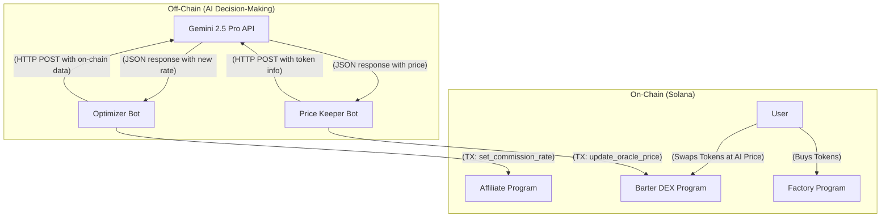

# Whitepaper: An AI-Hybrid Solana dApp Ecosystem

## Abstract

This document outlines the architecture of a novel, multi-program Solana ecosystem that integrates deterministic on-chain logic with intelligent, AI-driven off-chain decision-making. The system functions as a comprehensive token launchpad, featuring an ICO factory, a dynamic affiliate system, and a unique barter-style DEX. The core innovation lies in its hybrid model: while the Solana programs handle asset management and execution with blockchain's characteristic immutability, off-chain bots leverage the Gemini 2.5 Pro API to analyze on-chain data and make sophisticated economic adjustments. This creates a responsive, optimized, and automated tokenomic environment where parameters like affiliate commission rates and DEX pricing are not static but are intelligently managed by AI.

---

## 1. Introduction

Decentralized applications (dApps) on blockchains like Solana offer unparalleled security, transparency, and censorship resistance. However, their deterministic nature often requires rigid, pre-defined rules for economic models. This can limit a system's ability to adapt to changing market conditions. This project presents a solution by creating a hybrid architecture that combines the strengths of on-chain execution with the advanced analytical power of off-chain AI.

The ecosystem is comprised of three core on-chain programs and two off-chain AI bots, working in concert to create a full-featured token launch and trading platform.

- **On-Chain Components**:
    - `factory-program`: An ICO launchpad using a bonding curve.
    - `affiliate-program`: A referral system with AI-adjustable rates.
    - `barter-dex-program`: An oracle-based DEX powered by AI-generated prices.
- **Off-Chain AI Bots**:
    - `optimizer-bot`: Manages and optimizes affiliate commissions.
    - `price-keeper-bot`: Acts as the price oracle for the DEX.

This paper will detail the architecture of each component and illustrate how they interact to form a cohesive, intelligent system.

---

## 2. System Architecture

The core of the project is the separation of duties between the on-chain and off-chain worlds.

*   **On-Chain (Solana)**: The Solana programs are the "source of truth." They custody all assets (SOL and SPL tokens) in Program Derived Accounts (PDAs), enforce rules, and execute transactions atomically. They are deterministic and secure.
*   **Off-Chain (AI Bots)**: The bots are the "brains." They run on external servers, read the state of the on-chain programs, send this data to the Gemini AI for analysis, and submit transactions back to the blockchain to update key economic parameters.

This interaction can be visualized as follows:

---

## 3. On-Chain Components

The on-chain logic is deployed as three distinct but interconnected Solana programs written in Rust using the Anchor framework.

### 3.1 `factory-program`

This program serves as the ICO launchpad. It allows a project authority to create and sell a new token.

*   **State (`LaunchState`)**: Each ICO is represented by a `LaunchState` account, which is a PDA that holds the configuration for the launch. Its fields include:
    *   `authority`: The wallet authorized to withdraw the SOL raised.
    *   `token_mint`: The mint of the token being sold. The `LaunchState` PDA is the mint authority.
    *   `initial_price`: The starting price of the token in lamports.
    *   `slope`: The rate at which the price increases per token sold.
    *   `tokens_sold`: A counter for the number of tokens sold.

*   **Mechanism (Bonding Curve)**: Token price is not static. It's calculated by a linear bonding curve: `current_price = initial_price + (slope * tokens_sold)`. This ensures that the price automatically increases as more tokens are purchased.

*   **Key Instructions**:
    *   `create_launch`: Initializes the `LaunchState` and creates the `token_mint`.
    *   `buy_tokens`: The primary user interaction. A buyer sends SOL and receives a calculated amount of tokens. This instruction handles the SOL transfer to a secure vault PDA and mints new tokens to the buyer. Crucially, it can trigger a Cross-Program Invocation (CPI) to the `affiliate-program` if a referral is used.
    *   `withdraw_sol`: A permissioned instruction allowing the `authority` to withdraw the SOL collected in the vault.

### 3.2 `affiliate-program`

This program manages an on-chain affiliate system, allowing third parties to earn commissions by referring buyers to the ICO.

*   **State (`AffiliateInfo`)**: Each affiliate is represented by an `AffiliateInfo` account (a PDA), which stores:
    *   `affiliate_key`: The affiliate's wallet public key.
    *   `total_referred_volume`: The lifetime token volume referred by this affiliate.
    *   `commission_rate_bps`: The commission rate in basis points (e.g., 1000 = 10%). **This is the value the AI bot modifies.**

*   **Key Instructions**:
    *   `register_affiliate`: Allows any wallet to sign up as an affiliate, creating their `AffiliateInfo` account with a default commission rate.
    *   `set_commission_rate`: **The AI Hook.** A permissioned instruction that allows an authority (in this implementation, the affiliate themselves) to update the `commission_rate_bps`. The `optimizer-bot` calls this to enact the AI's suggestion.
    *   `process_commission`: A CPI-only instruction called by `factory-program`. When a referred purchase occurs, this function calculates the commission and mints the appropriate amount of tokens directly to the affiliate's token account.

### 3.3 `barter-dex-program`

This program implements a novel oracle-based DEX, which is fundamentally different from a standard Automated Market Maker (AMM).

*   **Mechanism (Oracle-Based Pricing)**: Instead of using an internal pricing formula like `x*y=k`, this DEX relies entirely on an external price feed. Swaps are executed at the price stored on-chain, which is provided by a trusted oracle—the `price-keeper-bot`.

*   **State (`LiquidityPool`)**: Each trading pair has a `LiquidityPool` account (a PDA) containing:
    *   `mint_a` & `mint_b`: The two token mints in the pool.
    *   `oracle_authority`: The public key of the wallet authorized to update the price (i.e., the `price-keeper-bot`).
    *   `oracle_price`: **The AI-generated price.** It stores the price of Token A in terms of Token B with 9 decimals of precision.
    *   `last_oracle_update`: A timestamp to prevent trading against a stale price.

*   **Key Instructions**:
    *   `create_pool`: Initializes a new liquidity pool for a token pair and sets the `oracle_authority`.
    *   `update_oracle_price`: **The AI Hook.** A permissioned instruction that can only be called by the `oracle_authority`. The `price-keeper-bot` uses this to push the AI-generated exchange rate on-chain.
    *   `swap`: Allows a user to swap tokens. The swap amount is calculated directly from the `oracle_price` (`amount_out = amount_in * oracle_price`). The transaction will fail if the on-chain price is too old (`OraclePriceStale` error) or if the pool lacks the necessary funds (`InsufficientLiquidity` error).

---

## 4. Off-Chain AI Components

The off-chain bots are Rust applications that use the `reqwest` library for HTTP calls to the Gemini API and the `anchor-client` library to interact with the Solana programs.

### 4.1 `optimizer-bot`

This bot's purpose is to dynamically manage affiliate commission rates to reward high-performing affiliates and optimize costs for under-performing ones.

*   **Workflow**:
    1.  **Fetch Data**: The bot queries the `affiliate-program` to get the current on-chain state (`AffiliateInfo`) for a given affiliate, including their `total_referred_volume` and `current_rate_bps`.
    2.  **Query AI**: It constructs a detailed prompt for the Gemini 2.5 Pro API, providing the on-chain data as context. The prompt asks the AI to act as a "Solana tokenomics expert" and suggest a new, optimal commission rate.
    3.  **Parse Response**: It parses the JSON response from the Gemini API to extract the suggested `new_rate_bps`.
    4.  **Submit Transaction**: If the suggested rate is different from the current rate, the bot builds, signs, and sends a transaction to the `affiliate-program` calling the `set_commission_rate` instruction with the new rate.

### 4.2 `price-keeper-bot`

This bot functions as a decentralized price oracle for the `barter-dex-program`.

*   **Workflow**:
    1.  **Fetch Data**: The bot queries the `barter-dex-program` to get the list of active liquidity pools and the mint addresses for each pair (`mint_a`, `mint_b`).
    2.  **Query AI**: It constructs a prompt asking the Gemini 2.5 Pro API to act as a "decentralized exchange price oracle" and determine the fair market exchange rate between the two tokens.
    3.  **Parse Response**: It parses the JSON response to extract the `price_of_a_in_b`, formatted as a `u64` integer with 9 decimals of precision.
    4.  **Submit Transaction**: The bot sends a transaction to the `barter-dex-program`, calling the `update_oracle_price` instruction for the corresponding pool. This updates the on-chain price that all users will use for swaps.

---

## 5. Conclusion

This Solana ecosystem pioneers a hybrid dApp architecture that synergizes the trustless execution of smart contracts with the adaptive intelligence of large language models. By delegating complex and subjective economic decisions—such as setting optimal fees or determining fair market value—to an off-chain AI, the system can achieve a level of sophistication and automation that is difficult to attain with purely deterministic on-chain logic. This model provides a blueprint for creating more dynamic, efficient, and intelligent decentralized systems.